# Game Overview

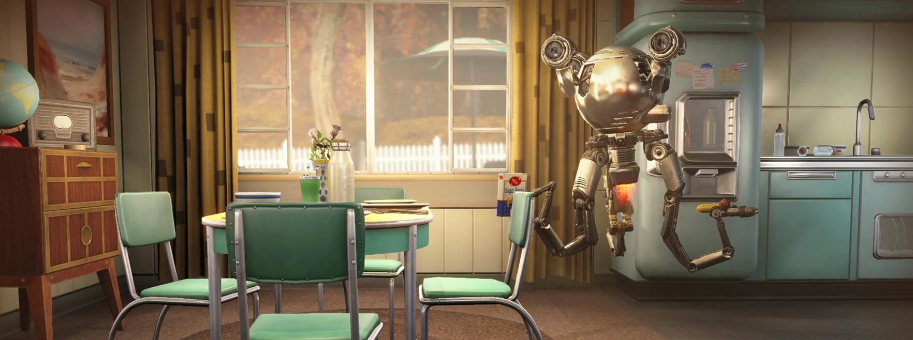{ width="700"}

## Introduction

Fallout 4 is a 2015 action role-playing game developed by Bethesda Game Studios and published by Bethesda Softworks. It is the fourth main game in the Fallout series and was released worldwide on November 10, 2015, for PlayStation 4, Windows, and Xbox One. The game is set within an open world post-apocalyptic environment that encompasses the city of Boston and the surrounding Massachusetts region known as "The Commonwealth".

The main story takes place in the year 2287, 10 years after the events of Fallout 3 and 210 years after "The Great War", which caused catastrophic nuclear devastation. The player assumes control of a character simply referred to as the "Sole Survivor", who emerges from a long-term cryogenic stasis in Vault 111, an underground nuclear fallout shelter. After witnessing the murder of their spouse and the kidnapping of their son, the Sole Survivor ventures out into the Commonwealth to search for their missing child. The player explores the game's dilapidated world, completes various quests, helps out various factions, and acquires experience points to level up and increase the abilities of their character. New features to the series include the ability to develop and manage settlements and an extensive crafting system where materials scavenged from the environment can be used to craft explosives, upgrade weapons and armor, and construct, furnish, and improve settlements. Fallout 4 is the first game in the series to feature a fully-voiced protagonist.

Fallout 4 received positive reviews from critics, with many praising the world depth, player freedom, overall amount of content, crafting, story, characters, and soundtrack. Criticism was mainly directed at the game's simplified role-playing elements compared to its predecessors and technical issues. The game shipped 12 million units to retailers, which generated $750 million within the first 24 hours of its launch. It received numerous accolades from various gaming publications and award events, including the respective awards for Game of the Year and Best Game at the D.I.C.E. Awards and British Academy Games Awards. Bethesda has released six downloadable content add-ons, including the expansions Far Harbor and Nuka-World.

### DLC Addons

#### Far Harbor

A new case from Valentine’s Detective Agency leads you on a search for a young woman and a secret colony of synths. Travel off the coast of Maine to the mysterious island of Far Harbor, where higher levels of radiation have created a more feral world. Will you work towards bringing peace to Far Harbor, and at what cost?

##### Image

{ width="300"}
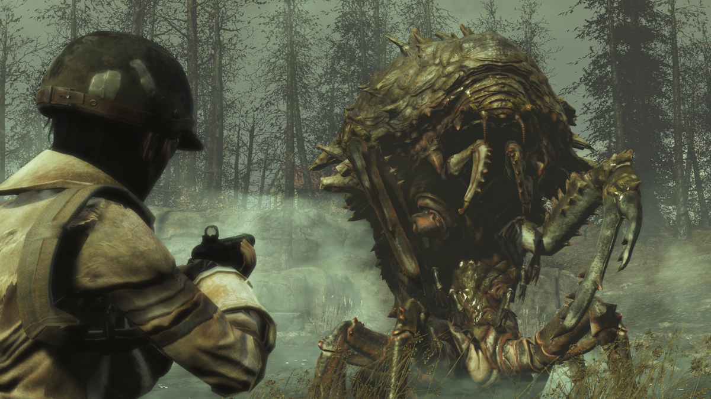{ width="500"}

##### Video

<iframe width="560" height="315" src="https://www.youtube.com/embed/B0wSCFBJcSs?si=muulALQE5EX1OiQk" title="YouTube video player" frameborder="0" allow="accelerometer; autoplay; clipboard-write; encrypted-media; gyroscope; picture-in-picture; web-share" referrerpolicy="strict-origin-when-cross-origin" allowfullscreen></iframe>

<iframe width="560" height="315" src="https://www.youtube.com/embed/bdaJTxM3Azs?si=KnzbhUhhp35gk7mB" title="YouTube video player" frameborder="0" allow="accelerometer; autoplay; clipboard-write; encrypted-media; gyroscope; picture-in-picture; web-share" referrerpolicy="strict-origin-when-cross-origin" allowfullscreen></iframe>

#### Nuka World
Take a trip to Nuka-World, a vast amusement park now a lawless city of Raiders. Explore an all-new region with an open wasteland and park zones like Safari Adventure, Dry Rock Gulch, Kiddie Kingdom, and the Galactic Zone. Lead lethal gangs of Raiders and use them to conquer settlements, bending the Commonwealth to your will. Nuka-World features new quests, Raiders, weapons, creatures, and more. Enjoy the ride!

##### Image

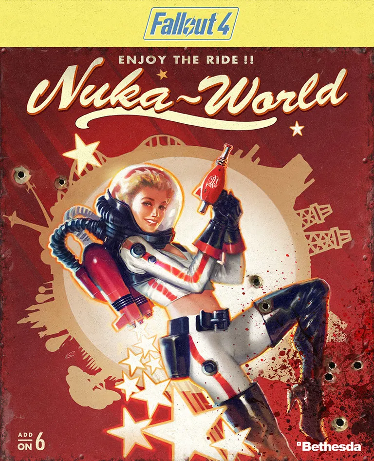{ width="300"}
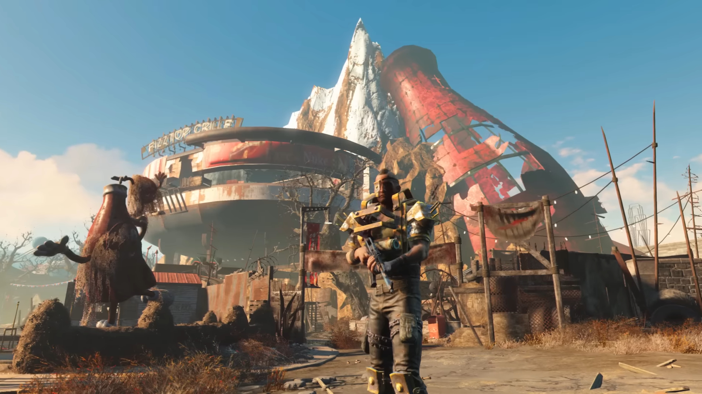{ width="500"}

##### Video

<iframe width="560" height="315" src="https://www.youtube.com/embed/DIneiOpuS2M?si=LWA98tlXjCFqgZhF" title="YouTube video player" frameborder="0" allow="accelerometer; autoplay; clipboard-write; encrypted-media; gyroscope; picture-in-picture; web-share" referrerpolicy="strict-origin-when-cross-origin" allowfullscreen></iframe>

<iframe width="560" height="315" src="https://www.youtube.com/embed/K5uFXByM1UU?si=mXt1cDrH2T63r-vz" title="YouTube video player" frameborder="0" allow="accelerometer; autoplay; clipboard-write; encrypted-media; gyroscope; picture-in-picture; web-share" referrerpolicy="strict-origin-when-cross-origin" allowfullscreen></iframe>

#### Automatron

The mysterious Mechanist has unleashed a horde of evil robots into the Commonwealth, including the devious Robobrain. Hunt them down and harvest their parts to build and mod your own custom robot companions. Choose from hundreds of mods; mixing limbs, armor, abilities, and weapons like the all-new lightning chain gun. Even customize their paint schemes and choose their voices! For characters level 15 or higher.

#### Images
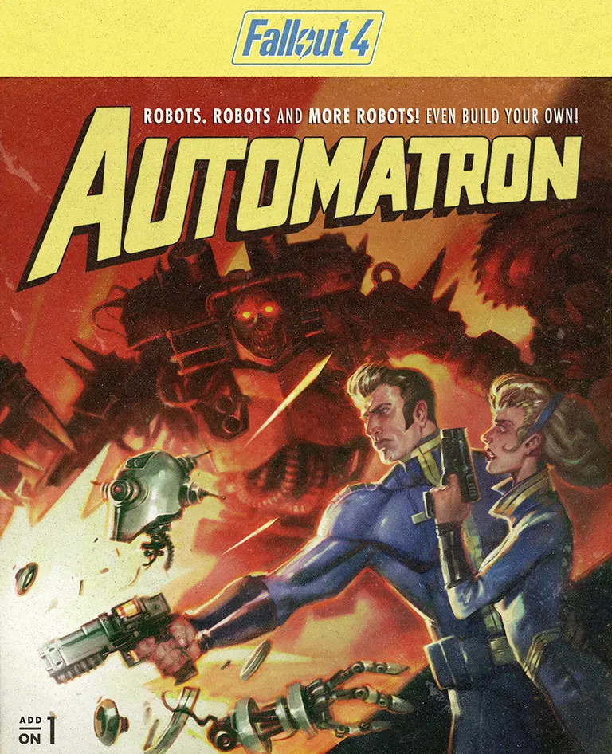{ width="300"}
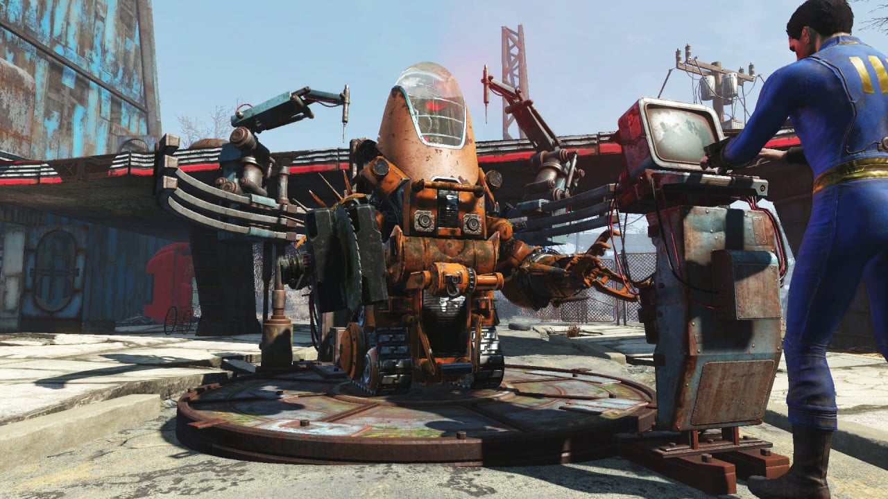{ width="500"}

##### Video

<iframe width="560" height="315" src="https://www.youtube.com/embed/aMY0IETkDrU?si=hEJf64krI4_ECShN" title="YouTube video player" frameborder="0" allow="accelerometer; autoplay; clipboard-write; encrypted-media; gyroscope; picture-in-picture; web-share" referrerpolicy="strict-origin-when-cross-origin" allowfullscreen></iframe>

<iframe width="560" height="315" src="https://www.youtube.com/embed/_MIH3HW8Mmo?si=yytre7_96POzDfFK" title="YouTube video player" frameborder="0" allow="accelerometer; autoplay; clipboard-write; encrypted-media; gyroscope; picture-in-picture; web-share" referrerpolicy="strict-origin-when-cross-origin" allowfullscreen></iframe>

#### Wastland Workshop
With the Wasteland Workshop, design and set cages to capture live creatures – from raiders to Deathclaws! Tame them or have them face off in battle, even against your fellow settlers. The Wasteland Workshop also includes a suite of new design options for your settlements like nixie tube lighting, letter kits, taxidermy and more!
#### Images
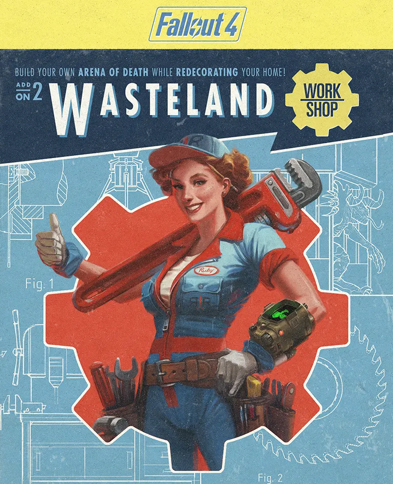{ width="300"}
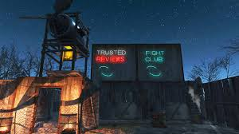{ width="500"}

##### Video

<iframe width="560" height="315" src="https://www.youtube.com/embed/2yPsk0tETS0?si=CLiL23hkQFZbDhhb" title="YouTube video player" frameborder="0" allow="accelerometer; autoplay; clipboard-write; encrypted-media; gyroscope; picture-in-picture; web-share" referrerpolicy="strict-origin-when-cross-origin" allowfullscreen></iframe>

<iframe width="560" height="315" src="https://www.youtube.com/embed/smbFhb1ttkw?si=q1HZToVMY9V9QEqD" title="YouTube video player" frameborder="0" allow="accelerometer; autoplay; clipboard-write; encrypted-media; gyroscope; picture-in-picture; web-share" referrerpolicy="strict-origin-when-cross-origin" allowfullscreen></iframe>

#### Contraptions WorkShop
Machines that sort! Machines that build! Machines that combine! With Fallout 4 Contraptions, use conveyer belts, scaffolding kits, track kits, even logic gates to construct crazy and complex gadgets to improve your Wasteland settlements. The Contraptions Workshop also includes all-new features like elevators, greenhouse kits, warehouse kits, fireworks, armor racks and more!
#### Images

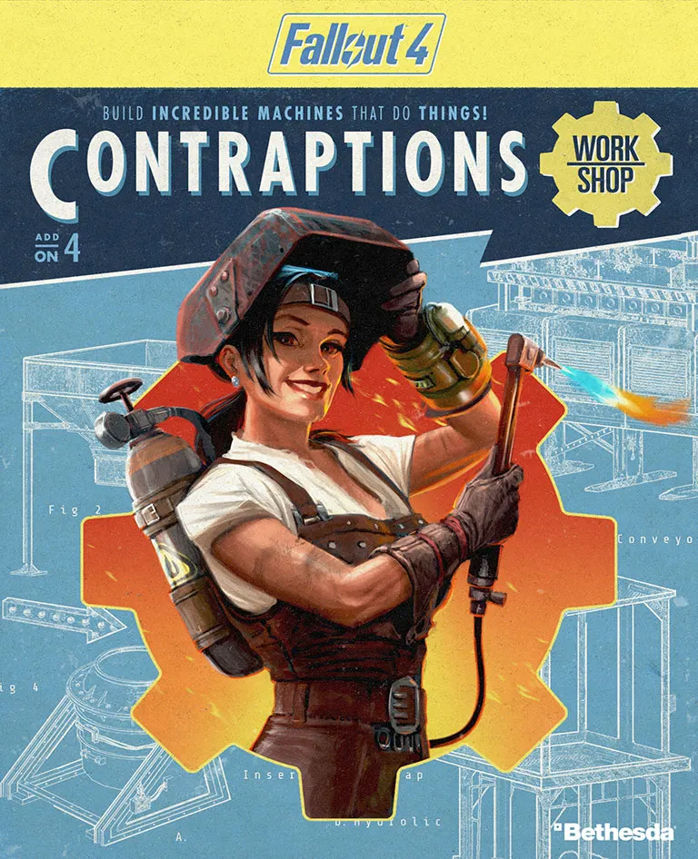{ width="300"}
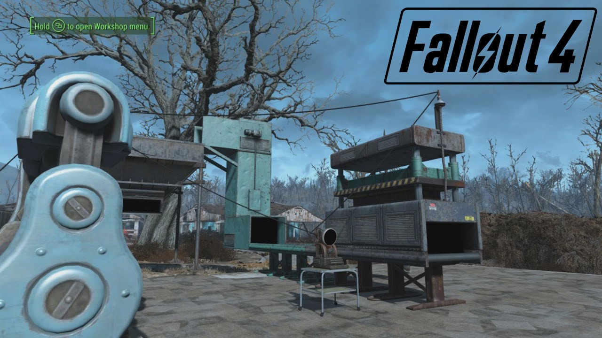{ width="500"}

##### Video

<iframe width="560" height="315" src="https://www.youtube.com/embed/10ScweKHfBs?si=PhHq8JYm8yDs8m89" title="YouTube video player" frameborder="0" allow="accelerometer; autoplay; clipboard-write; encrypted-media; gyroscope; picture-in-picture; web-share" referrerpolicy="strict-origin-when-cross-origin" allowfullscreen></iframe>

<iframe width="560" height="315" src="https://www.youtube.com/embed/ZlnKU6YvjOg?si=6WbcbCRiR5uey58T" title="YouTube video player" frameborder="0" allow="accelerometer; autoplay; clipboard-write; encrypted-media; gyroscope; picture-in-picture; web-share" referrerpolicy="strict-origin-when-cross-origin" allowfullscreen></iframe>

#### Vault Tech Workshop
Build a brighter future underground with the all-new Vault-Tec Workshop. Create a Vault using pre-war industrial kits complete with retro-nostalgic furniture, lighting, and art designed to increase the productivity of your Dwellers. And like every good Overseer, run Vault-Tec approved experiments and turn your Dwellers into test subjects! Vault-Tec has given you the tools, the rest is up to you!

#### Images
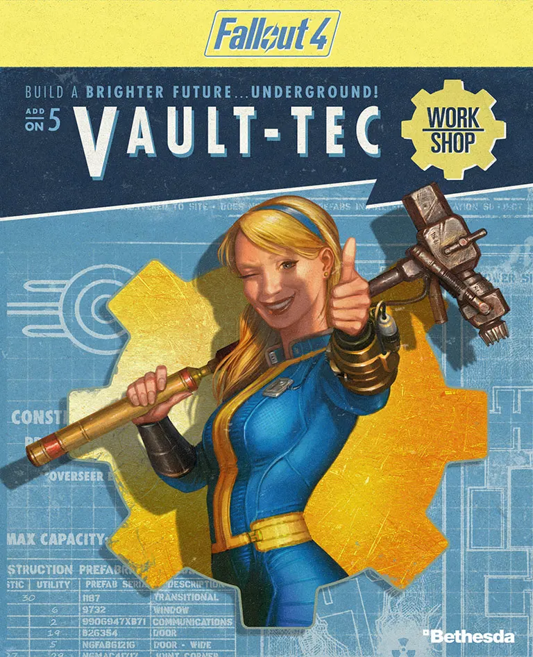{ width="300"}
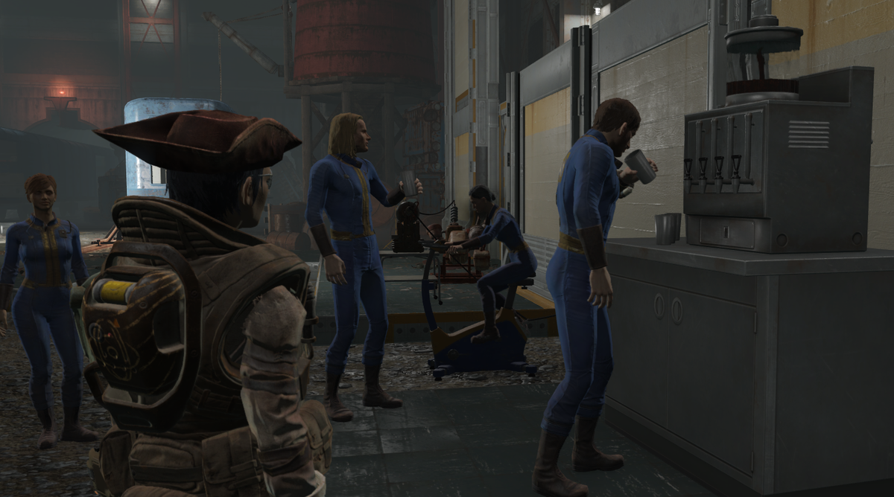{ width="500"}

##### Video

<iframe width="560" height="315" src="https://www.youtube.com/embed/Yooin4piBPo?si=Sh2oUhVOiuSCK01a" title="YouTube video player" frameborder="0" allow="accelerometer; autoplay; clipboard-write; encrypted-media; gyroscope; picture-in-picture; web-share" referrerpolicy="strict-origin-when-cross-origin" allowfullscreen></iframe>

<iframe width="560" height="315" src="https://www.youtube.com/embed/Wb6edgIP7y8?si=frDD5N3YpZorocMW" title="YouTube video player" frameborder="0" allow="accelerometer; autoplay; clipboard-write; encrypted-media; gyroscope; picture-in-picture; web-share" referrerpolicy="strict-origin-when-cross-origin" allowfullscreen></iframe>

## Plot
Fallout 4 takes place in the year 2287, 10 years after the events of Fallout 3 and 210 years after the Great War, a war between the United States and China over natural resources that ended in a nuclear holocaust in 2077. The setting is post-apocalyptic, covering a region that includes Boston and other parts of New England known as "The Commonwealth". Unlike the previous titles, Fallout 4's story begins on the day the bombs dropped: October 23, 2077.

The game takes place in an alternate version of history that features 1940s and 1950s aesthetics, such as diners and a drive-in theater, while design and technologies advance in the directions imagined during the era. The resulting universe is thus a retro-futuristic one, where the technology has evolved enough to produce laser weapons, manipulate genes and create nearly-autonomous artificial intelligence, all within the confines of 1950s' technology such as the widespread use of atomic power and vacuum tubes, as well as having the integrated circuitry of the digital age. The architecture, advertisements, and general living styles are depicted to be largely unchanged since the 1950s, while including contemporary products, such as a robotic rocking horse for children in one advertisement, or posters for the underground Vaults that play a central role in the storyline of the game.

There are four main factions that the player can choose to support throughout the story; the Institute, a secretive organization that specializes in the creation of artificial humanoids called "synths", the Brotherhood of Steel, an anti-synth faction hoping to preserve and control technology in the Commonwealth; the Minutemen, a faction that aims to drive out raiders and other threats out of the Commonwealth; and the Railroad, a secretive organization dedicated to rescuing synths from the Institute.

## Story

In the Commonwealth during the year 2077, the protagonist and their family—consisting of their husband Nate (Brian T. Delaney) or wife Nora (Courtenay Taylor), depending on the player's chosen sex, and their baby son Shaun—escape into Vault 111, gaining entry due to a Vault-Tec representative signing them up for it immediately prior to a nuclear attack. Inside, the family members are tricked into entering cryogenic tubes and frozen alive. 150 years later, the protagonist's spouse is killed and Shaun is taken away by a mysterious group. The life support system malfunctions at a later date and unfreezes the protagonist, who leaves their tube to find the remaining residents of Vault 111 deceased, gaining the nickname of the "Sole Survivor". They return home and reunite with their former robot butler Codsworth (Stephen Russell), who reveals that a total of 210 years have passed since the nuclear attack. At Codsworth's suggestion, the Sole Survivor reaches the nearby town of Concord, befriending a dog named Dogmeat (River) and a member of a revived version of the Minutemen named Preston Garvey (Jon Gentry).

In Diamond City, the Sole Survivor learns that an organization called the Institute has been terrifying the Commonwealth by kidnapping humans and replacing them with Synths, humanoid robots who are indistinguishable from real humans. After rescuing android private detective Nick Valentine (Russell), the Sole Survivor uncovers the identity of their spouse's killer as Conrad Kellogg (Keythe Farley). The Sole Survivor hunts down Kellogg and kills him, though Kellogg spends his last moments revealing that Shaun is being held in the Institute. The Sole Survivor steals a cybernetic device from Kellogg's brain to access his memories with the help of Dr. Amari (Meher Tatna). Meanwhile, the Brotherhood of Steel arrives in the Commonwealth, and a former Institute employee instructs the Sole Survivor to craft a teleportation device required to infiltrate the Institute. With the help of the Railroad, an underground movement aiming to free Synths from the Institute, the Sole Survivor retrieves a chip and has it decoded. After successfully crafting the teleportation device, the Sole Survivor enters the Institute.

The Sole Survivor meets a much older Shaun (Tony Amendola), who is revealed to have become the Institute's director and explains that his abduction 60 years ago was part of a Synth experiment due to his pre-war DNA. Should the Sole Survivor choose to align themselves with Shaun, they learn that Shaun is dying of cancer and agree to his request that they succeed him as the Institute's director, helping him track down and re-enslave escaped Synths. Should the Sole Survivor refuse to join Shaun, they engage in combat against Shaun and the entire Institute with the help of various other anti-Institute factions; the Sole Survivor then detonates a nuclear reactor, destroying the Institute. If the Sole Survivor officially joined the Minutemen earlier in the game, the Minutemen will help them wipe out the other factions.